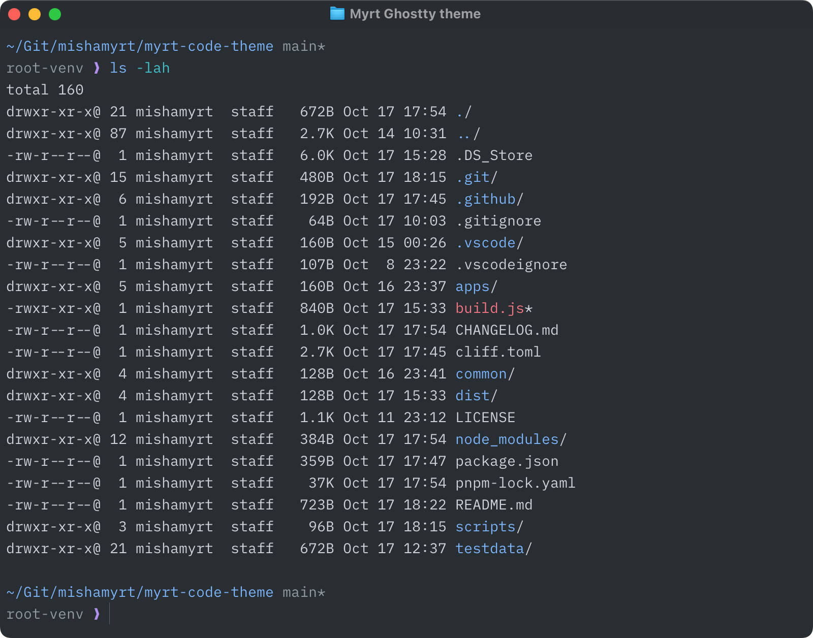

# Myrt Ghostty theme

Myrt theme for [Ghostty](https://ghostty.org) terminal emulator.



## Install

```bash
bash -c "$(curl -fsSL https://raw.githubusercontent.com/mishamyrt/myrt-code-theme/main/apps/ghostty/install.sh)"
```